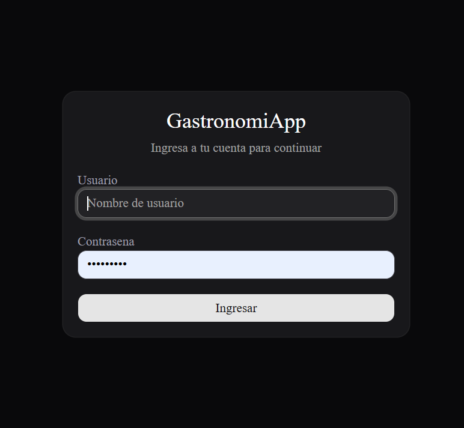
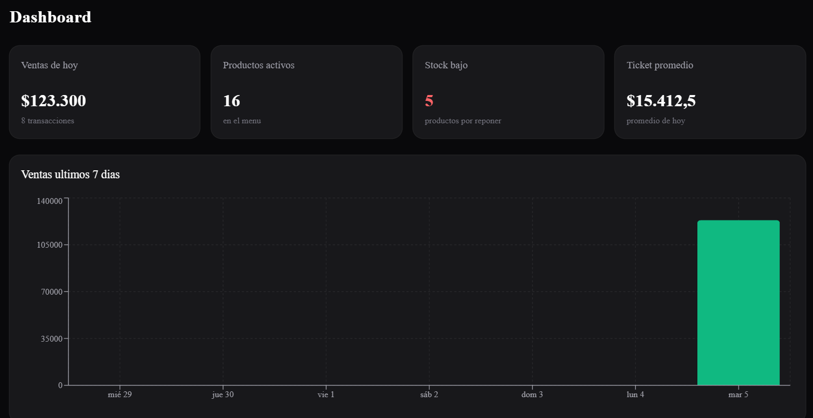
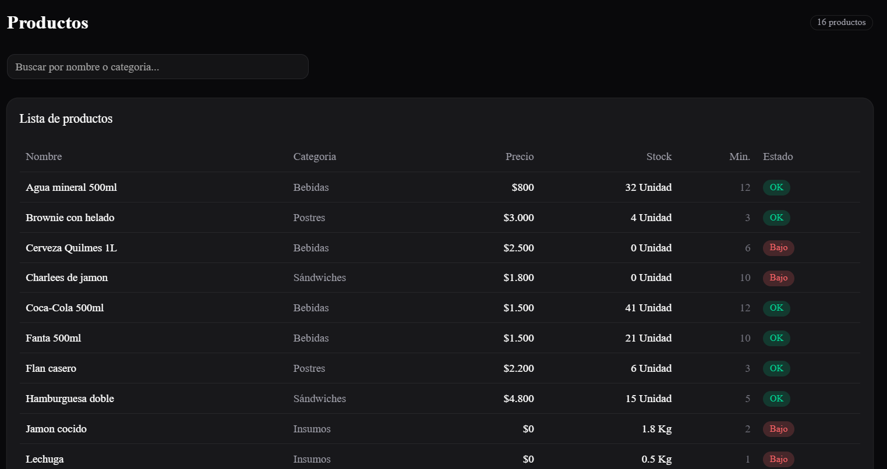
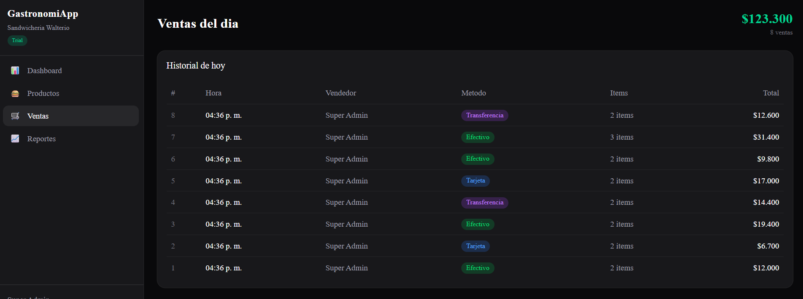
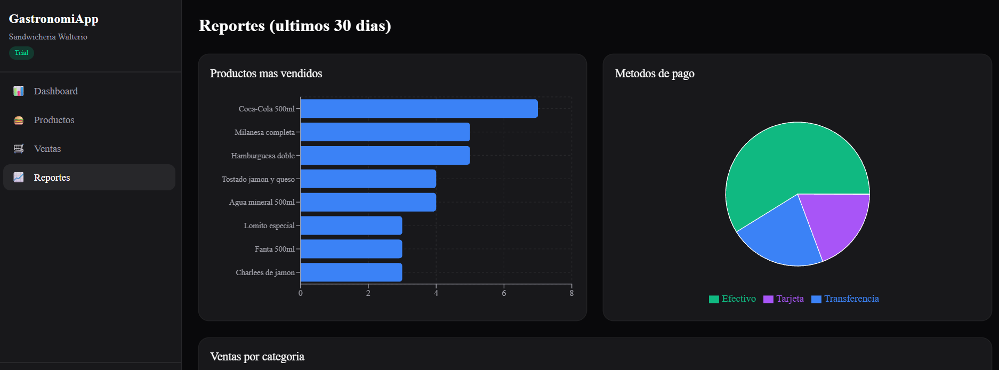

# GastronomiApp Dashboard

Dashboard de metricas y gestion para negocios gastronomicos. Consume una API REST con autenticacion JWT y muestra datos en tiempo real.

## Screenshots

### Login


### Dashboard


### Productos


### Ventas


### Reportes


## Tech Stack

- **Next.js 16** (App Router)
- **TypeScript**
- **Tailwind CSS v4**
- **Shadcn/ui** (Card, Table, Badge, Input, Skeleton, Button, Sidebar)
- **Recharts** (graficos de barras, torta)
- **REST API** con autenticacion JWT

## Features

- Login con JWT y proteccion de rutas
- Dashboard con metricas: ventas del dia, ticket promedio, stock bajo
- Grafico de ventas de los ultimos 7 dias
- Tabla de productos con busqueda y alertas de stock
- Historial de ventas del dia con metodo de pago
- Reportes: productos mas vendidos, metodos de pago (pie chart), ventas por categoria
- Sidebar con navegacion y datos del tenant
- Dark theme completo
- Responsive design

## Pages

| Ruta | Descripcion |
|------|-------------|
| `/login` | Autenticacion con JWT |
| `/` | Dashboard con metricas y graficos |
| `/productos` | Tabla de productos con busqueda y estado de stock |
| `/ventas` | Ventas del dia con detalle |
| `/reportes` | Graficos estadisticos (barras, torta) |

## Getting Started

```bash
npm install
```

Create a `.env.local` file:

```env
NEXT_PUBLIC_API_URL=http://localhost:5000/api
```

```bash
npm run dev
```

Open [http://localhost:3000](http://localhost:3000)

## API Integration

This dashboard consumes a multi-tenant REST API built with ASP.NET Core + PostgreSQL. Endpoints used:

- `POST /api/auth/login` — JWT authentication
- `GET /api/productos` — Products list with stock info
- `GET /api/ventas/del-dia` — Today's sales
- `GET /api/reportes/productos-mas-vendidos` — Top selling products
- `GET /api/reportes/ventas-por-metodo-pago` — Sales by payment method
- `GET /api/reportes/ventas-por-categoria` — Sales by category
- `GET /api/reportes/ventas-por-dia` — Sales by day (chart)

## Project Structure

```
src/
├── app/
│   ├── layout.tsx              # Root layout (dark theme)
│   ├── providers.tsx           # Auth + Tooltip providers
│   ├── page.tsx                # Dashboard (metrics + chart)
│   ├── login/page.tsx          # Login page
│   ├── productos/page.tsx      # Products table
│   ├── ventas/page.tsx         # Sales history
│   └── reportes/page.tsx       # Charts and reports
├── components/
│   ├── dashboard-layout.tsx    # Sidebar + main layout
│   └── ui/                     # Shadcn/ui components
└── lib/
    ├── api.ts                  # HTTP client with JWT
    ├── auth-context.tsx        # Auth context (React Context)
    └── types.ts                # TypeScript interfaces
```

## Part of GastronomiApp Ecosystem

This dashboard is one piece of a complete gastronomy management system:

1. **Desktop App** (WPF / .NET 9) — Point of sale with thermal printing
2. **SaaS Frontend** (React + TypeScript) — Multi-tenant web app
3. **Dashboard** (Next.js + Shadcn/ui) — This project
4. **REST API** (ASP.NET Core + PostgreSQL) — Shared backend

## Deploy

Ready for deployment on [Vercel](https://vercel.com). Set the `NEXT_PUBLIC_API_URL` environment variable in your Vercel project settings.
